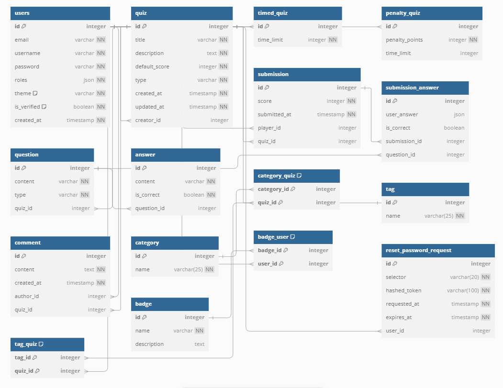

# Installation QuizDown

## Prérequis
- Docker & Docker Compose
- Make (Makefile pour automatiser les commandes)
- Symfony CLI

## Installation
```bash
git clone https://github.com/Anthony14FR/QuizDown
cd QuizDown
cp .env.dev .env
composer install
npm i && npm run dev
docker compose -f compose.dev.yaml up -d
make reset
```

## Démarrage
```bash
symfony serve
```

## Accès
- Application: http://localhost:8000
- PhpMyAdmin: http://localhost:8081
    - User: symfony
    - Password: symfony

## Comptes
- Admin: admin@orus.com / Admin123
- User: user@orus.com / User123


# Schéma de la base de données


